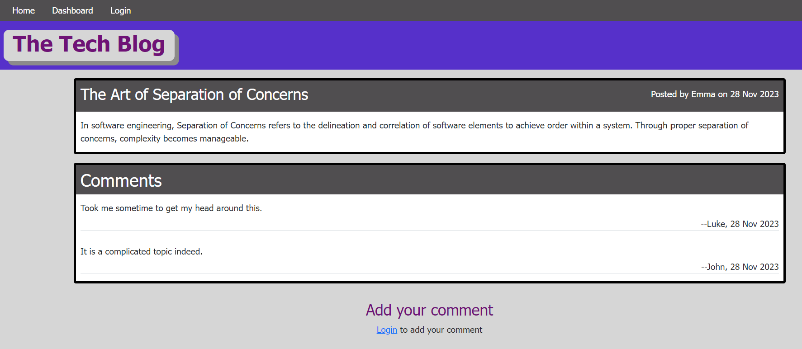
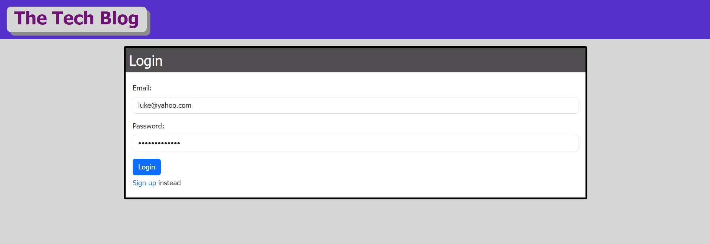
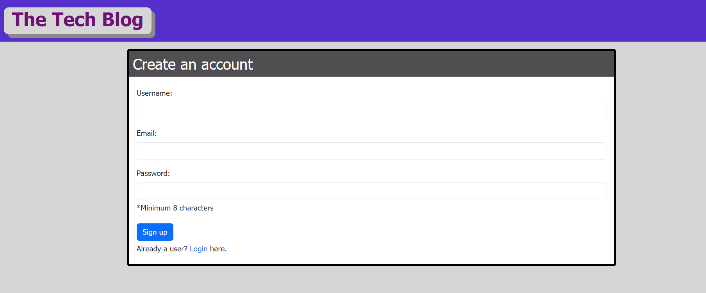
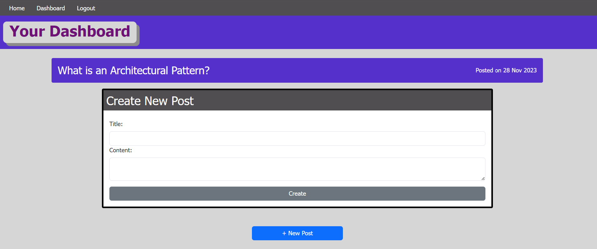
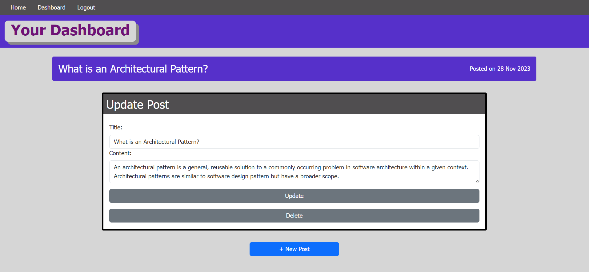

# Tech-Blog

## Description
    
A blog site where developers can publish their blog posts and comment on other developers’ posts.
    
## Table of Contents
    
- [Installation](#installation)
- [Usage](#usage)
- [Credits](#credits)
- [License](#license)
- [How to Contribute](#how-to-contribute)
- [Tests](#tests)
    
## Installation
    
Open url link https://tech-blog-site-2023-38e4d227d305.herokuapp.com/ in a browser such as Google Chrome, Firefox or Edge etc.

## Usage

You can read blog posts published by others on the Home page and read any comments associated with that post by clicking on the post title.

 

If the you'd like to add your own comment to a post or write your own post, you will need to either login or sign up first. Once you've logged in, you can access your own posts from the Dashboard page. You can create a new post by clicking on the + New Post button, or update/delete your past posts.

 
 
 
 
    
## Credits
NA

## License
 
This project is licensed under the MIT License - see the [LICENSE.md](license) file for details    
 
## How to Contribute
    
Feel free to contribute your ideas or bug fixes for this project by raising a new issue or new pull request.
    
## Tests
NA
